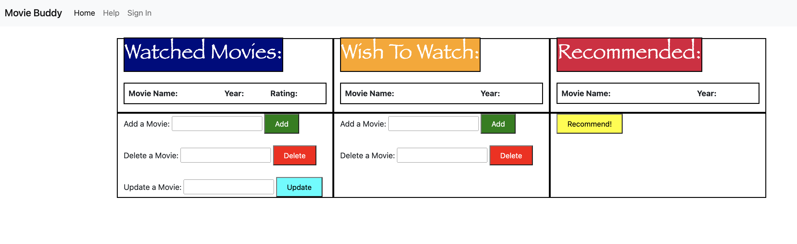

# Data Interactions
This remains the same as the first milestone.
# Home Page

The image above shows what the application looks like.

The users have access to three buttons in the navigation bar.
* The home button which just redirects to the home page.
* The help button which brings up a pop up window explaning how the appplication works.
* The sign in button which the user can use to sign into the application.

Furthumroe, the application maintains three lists for each user.
* The first list maintians the list of movies that the user has watched.
There are three controls provided to the user which they can use to modify the list.
They could either add a new movie, delete a movie, or modify their rating of a previously added movie.
* The second list maintians the list of movies that the user wishes to watch in the future.
There are two controls provided to the user which they can use to modify the list.
They could either add a new movie or delete a movie.
* The third list maintians the list of movies that the applicationsrecommends to the user based on his/her ratings of the watched movies. There is one control provided to the user which they can use to modify the list.
They could click the recommend button to get updated recommendations.

# Link of Video Showing the Application Running
[Demonstration Video](https://www.loom.com/share/104d25556d0a4e4eabc1241eb32d4226)
